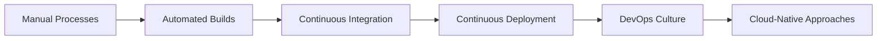

# Lecture 1: Introduction to Modern Build and Release Management

## 1. What is Build and Release Management? 🏗️

Build and Release Management is a crucial process in software development that involves compiling source code into executable programs and deploying them to production environments. It encompasses various stages, tools, and practices to ensure smooth and efficient software delivery.

### Key Components:
- 🔧 Build: Compiling and assembling code
- 📦 Package: Creating deployable units
- 🚀 Release: Deploying to production
- 🔁 Continuous Integration/Continuous Deployment (CI/CD)

## 2. Evolution of Build and Release Management 📈



### Traditional Approach:
- Manual builds and deployments
- Long release cycles
- Limited collaboration between development and operations

### Modern Approach:
- Automated builds and tests
- Frequent, smaller releases
- Close collaboration (DevOps)
- Cloud-native technologies

## 3. Benefits of Modern Build and Release Management 🌟

1. **Faster Time-to-Market**: Automate repetitive tasks, reducing release cycles.
2. **Improved Quality**: Consistent builds and automated testing catch issues early.
3. **Enhanced Collaboration**: DevOps practices bridge the gap between development and operations.
4. **Increased Efficiency**: Streamlined processes save time and resources.
5. **Better Visibility**: Improved tracking and reporting of build and release status.

## 4. Core Concepts in Modern Build Management 🧠

### 4.1 Continuous Integration (CI)
- Frequent merging of code changes
- Automated building and testing
- Early detection of integration issues

### 4.2 Continuous Deployment (CD)
- Automated deployment to production
- Ensures latest changes are always available
- Requires robust testing and monitoring

### 4.3 Version Control
- Git, SVN, Mercurial
- Tracks changes and manages code versions
- Facilitates collaboration and code reviews

### 4.4 Artifact Management
- Storing and versioning build outputs
- Examples: JFrog Artifactory, Nexus Repository

### 4.5 Infrastructure as Code (IaC)
- Defining infrastructure using code
- Tools: Terraform, Ansible, CloudFormation
- Enables reproducible and version-controlled environments

## 5. Build Concepts in Detail 🏭

### 5.1 Build Triggers
- Push to repository
- Pull request creation
- Scheduled builds
- Manual triggers

### 5.2 Build Environments
- Containerized build environments (Docker)
- Virtual machines
- Cloud-based build services

### 5.3 Build Steps
1. Code checkout
2. Dependency resolution
3. Compilation
4. Unit testing
5. Static code analysis
6. Artifact generation

### 5.4 Build Artifacts
- Compiled binaries
- Docker images
- Documentation
- Test reports

## 6. Introduction to Cloud-Native Build Management ☁️

Cloud-native build management leverages cloud technologies to enhance the build and release process.

### Key Features:
- Scalability: Easily handle large-scale builds
- Flexibility: Adapt to varying workloads
- Cost-effective: Pay only for resources used
- Global availability: Distribute builds across regions

### Popular Cloud-Native Build Tools:
- Jenkins X
- GitLab CI/CD
- GitHub Actions
- AWS CodeBuild
- Google Cloud Build

## 7. Build Reporting 📊

Build reporting provides insights into the build process, helping teams identify issues and improve efficiency.

### 7.1 Sample GitHub Actions Report

```yaml
name: CI
on: [push]
jobs:
  build:
    runs-on: ubuntu-latest
    steps:
    - uses: actions/checkout@v2
    - name: Run tests
      run: |
        npm install
        npm test
    - name: Build
      run: npm run build
```

### 7.2 Build Status and Badges

Badges provide quick visual indicators of build status:


## 8. Practical Exercise: Setting Up a Basic CI/CD Pipeline 🛠️

### Task:
Set up a simple CI/CD pipeline for a Node.js application using GitHub Actions.

### Steps:
1. Create a new GitHub repository
2. Add a simple Node.js application with a test
3. Create a `.github/workflows/ci.yml` file
4. Configure the workflow to run tests on push
5. Add a build step to create a production-ready artifact
6. (Optional) Configure deployment to a cloud platform

### Sample workflow file:

```yaml
name: Node.js CI/CD

on: [push]

jobs:
  build:
    runs-on: ubuntu-latest

    steps:
    - uses: actions/checkout@v2
    - name: Use Node.js
      uses: actions/setup-node@v2
      with:
        node-version: '14.x'
    - run: npm ci
    - run: npm test
    - run: npm run build
    - name: Archive production artifacts
      uses: actions/upload-artifact@v2
      with:
        name: dist
        path: dist
```

## 9. Conclusion and Next Steps 🎓

Modern Build and Release Management is essential for efficient software development. In this lecture, we've covered the basics, evolution, and key concepts. In the upcoming lectures, we'll dive deeper into cloud-native approaches, dependency management, and advanced topics in build and release management.

### Review Questions:
1. What are the main differences between traditional and modern build management?
2. Explain the concept of Continuous Integration and its benefits.
3. How does cloud-native build management improve the development process?
4. What information can you gather from build reports and status badges?

### Further Reading:
- "Continuous Delivery: Reliable Software Releases through Build, Test, and Deployment Automation" by Jez Humble and David Farley
- "Cloud Native DevOps with Kubernetes" by John Arundel and Justin Domingus

Next lecture, we'll explore Cloud-Native Build Management and Reporting in more detail.
