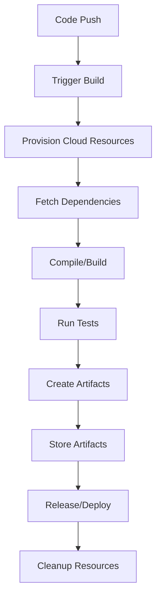
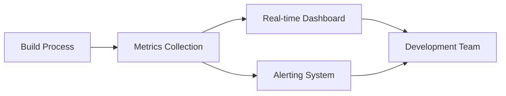

# Lecture 2: Cloud-Native Build Management and Reporting

## 1. Introduction to Cloud-Native Build Management 🌥️

Cloud-native build management leverages cloud technologies and principles to enhance the build and release process, making it more scalable, flexible, and efficient.

### Key Characteristics:
- 🔄 Elasticity: Automatically scale resources up or down based on demand
- 🌐 Distributed: Spread across multiple geographic regions for better performance
- 🧩 Microservices architecture: Decompose build processes into smaller, manageable services
- 🔒 Secure: Built-in security features and compliance with cloud security standards
- 💸 Pay-as-you-go: Cost-effective, paying only for resources used

## 2. Cloud-Native Build Platforms 🏗️

### Popular Platforms:
1. Jenkins X
2. GitLab CI/CD
3. GitHub Actions
4. AWS CodeBuild
5. Google Cloud Build
6. Azure Pipelines

Let's compare some of these platforms:

| Platform | Pros | Cons |
|----------|------|------|
| Jenkins X | Open-source, highly customizable | Steep learning curve |
| GitHub Actions | Tight integration with GitHub, large marketplace | Limited to GitHub repositories |
| AWS CodeBuild | Deep integration with AWS services | Vendor lock-in |
| Google Cloud Build | Fast, scalable, integrates well with GCP | Primarily suited for GCP projects |

## 3. Cloud-Native Build Process 🔄



### Key Steps:
1. **Trigger**: Automated triggers based on code commits, pull requests, or schedules
2. **Resource Provisioning**: Dynamically allocate cloud resources for the build
3. **Build Execution**: Compile code, run tests, and generate artifacts
4. **Artifact Storage**: Store build outputs in cloud-based artifact repositories
5. **Deployment**: Automatically deploy to staging or production environments
6. **Cleanup**: Release cloud resources to optimize costs

## 4. Containerization in Cloud-Native Builds 📦

Containers play a crucial role in cloud-native build management, offering consistency and portability.

### Benefits of Containerized Builds:
- 🔄 Consistency: Same environment for development, testing, and production
- 🚀 Faster startup: Containers are lightweight and quick to initialize
- 🧩 Isolation: Each build runs in its own container, preventing conflicts
- 📦 Portability: Easily move builds between different cloud providers

### Example: Dockerfile for a Node.js Build Environment

```dockerfile
FROM node:14

WORKDIR /app

COPY package*.json ./

RUN npm install

COPY . .

CMD ["npm", "run", "build"]
```

## 5. Cloud-Native Build Reporting 📊

Cloud-native build reporting provides real-time insights into the build process, helping teams identify issues and improve efficiency.

### 5.1 Key Metrics in Cloud-Native Build Reporting

1. **Build Duration**: Time taken for each build
2. **Success Rate**: Percentage of successful builds
3. **Resource Utilization**: CPU, memory, and network usage during builds
4. **Cost per Build**: Financial impact of each build
5. **Test Coverage**: Percentage of code covered by tests
6. **Security Scan Results**: Vulnerabilities detected in dependencies or code

### 5.2 Real-time Monitoring and Alerting

Cloud-native platforms often provide real-time monitoring dashboards and alerting mechanisms.



### 5.3 Sample GitHub Actions Report

```yaml
name: CI
on: [push]
jobs:
  build:
    runs-on: ubuntu-latest
    steps:
    - uses: actions/checkout@v2
    - name: Use Node.js
      uses: actions/setup-node@v2
      with:
        node-version: '14.x'
    - run: npm ci
    - run: npm test
    - run: npm run build
    - uses: actions/upload-artifact@v2
      with:
        name: dist
        path: dist
```

## 6. Build Status and Badges 🏅

Build status badges provide a quick visual indicator of the current state of your project's build.

### Types of Badges:
- Build Status: 
- Test Coverage: 
- Security Scan: 
- Performance: 

### Implementing Badges:
1. Generate badge URLs from your CI/CD platform
2. Add badge markdown to your README.md file
3. Configure your CI/CD pipeline to update badges automatically

## 7. Advanced Reporting Techniques 📈

### 7.1 Build Analytics

Utilize big data analytics to gain deeper insights into your build processes:
- Trend analysis of build times
- Correlation between code changes and build failures
- Predictive analytics for resource allocation

### 7.2 Custom Reporting Dashboards

Create tailored dashboards using tools like Grafana or Datadog to visualize:
- Build performance across different teams or projects
- Resource utilization patterns
- Cost optimization opportunities

### 7.3 Integration with Project Management Tools

Connect your build reports with project management tools like Jira or Trello to:
- Automatically create tickets for build failures
- Update story points based on build complexity
- Track development velocity in relation to build metrics

## 8. Practical Exercise: Setting Up Cloud-Native Builds and Reporting 🛠️

### Task:
Set up a cloud-native build pipeline for a Node.js application using GitHub Actions and implement custom reporting.

### Steps:
1. Fork a sample Node.js repository on GitHub
2. Create a `.github/workflows/cloud-build.yml` file
3. Configure the workflow to use GitHub-hosted runners
4. Implement build steps: install dependencies, run tests, build the application
5. Add a step to generate a code coverage report
6. Implement a custom build status badge
7. Create a simple dashboard using GitHub Pages to display build metrics

### Sample workflow file with reporting:

```yaml
name: Cloud-Native CI/CD

on: [push]

jobs:
  build:
    runs-on: ubuntu-latest

    steps:
    - uses: actions/checkout@v2
    - name: Use Node.js
      uses: actions/setup-node@v2
      with:
        node-version: '14.x'
    - run: npm ci
    - run: npm test
    - name: Generate coverage report
      run: npm run coverage
    - name: Upload coverage to Codecov
      uses: codecov/codecov-action@v1
    - run: npm run build
    - name: Archive production artifacts
      uses: actions/upload-artifact@v2
      with:
        name: dist
        path: dist
    - name: Update build status badge
      uses: schneegans/dynamic-badges-action@v1.0.0
      with:
        auth: ${{ secrets.GIST_SECRET }}
        gistID: gist_id_here
        filename: build-status.json
        label: build
        message: passing
        color: brightgreen
```

## 9. Conclusion and Next Steps 🎓

Cloud-native build management and reporting offer powerful tools for modern software development. They provide scalability, flexibility, and deep insights into the build process. As we move forward, these technologies will continue to evolve, offering even more sophisticated ways to manage and optimize our build pipelines.

### Review Questions:
1. How does cloud-native build management differ from traditional build processes?
2. What are the key benefits of using containerization in cloud-native builds?
3. Explain the importance of real-time monitoring and alerting in cloud-native build reporting.
4. How can build status badges improve project visibility and collaboration?

### Further Reading:
- "Cloud Native DevOps with Kubernetes" by John Arundel and Justin Domingus
- "Continuous Delivery with Docker and Jenkins" by Rafal Leszko
- "Pro GitHub Actions" by Jose Luis Aznarte

In our next lecture, we'll explore "Release Planning and Containerization in Agile Environments," building on the cloud-native concepts we've covered today.
