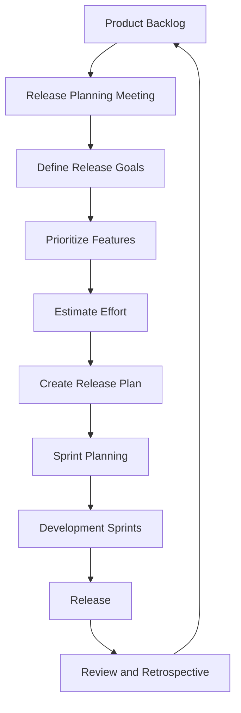
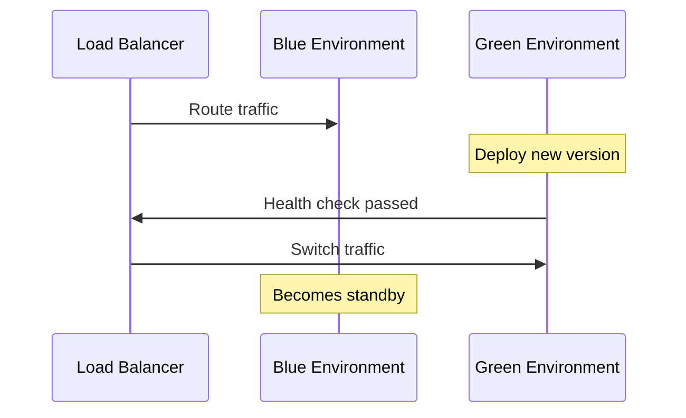

# Lecture 3: Release Planning and Containerization in Agile Environments

## 1. Introduction to Release Planning in Agile 🎯

Release planning in Agile environments is a critical process that bridges the gap between high-level project goals and day-to-day development activities. It involves scheduling and coordinating the delivery of new features, improvements, and bug fixes.

### Key Principles of Agile Release Planning:
- 🔄 Iterative and incremental delivery
- 🤝 Collaboration between development teams and stakeholders
- 🔍 Continuous refinement based on feedback and changing priorities
- 🚀 Focus on delivering value early and often

## 2. The Release Planning Process 📅



### 2.1 Steps in Release Planning:

1. **Review Product Backlog**: Assess and refine existing user stories and features.
2. **Define Release Goals**: Set clear objectives for the upcoming release.
3. **Prioritize Features**: Determine which features are most important for achieving release goals.
4. **Estimate Effort**: Use techniques like story points or t-shirt sizes to estimate work.
5. **Create Release Plan**: Map out sprints and allocate features to each sprint.
6. **Conduct Sprint Planning**: Break down features into specific tasks for each sprint.
7. **Execute Development Sprints**: Implement features and gather feedback.
8. **Perform Release**: Deploy the new version to production.
9. **Review and Retrospective**: Evaluate the release and identify areas for improvement.

## 3. Agile Estimation Techniques 📊

Estimation is crucial for effective release planning. Here are some popular Agile estimation techniques:

### 3.1 Planning Poker
- Team members use numbered cards to vote on effort estimates
- Encourages discussion and consensus-building

### 3.2 T-Shirt Sizing
- Use sizes (XS, S, M, L, XL) to estimate relative effort
- Quick and intuitive for high-level planning

### 3.3 Story Points
- Abstract measure of effort, complexity, and uncertainty
- Allows for relative sizing of user stories

Example Story Point Scale:
| Points | Description |
|--------|-------------|
| 1      | Trivial task |
| 2      | Simple task |
| 3      | Moderate task |
| 5      | Complex task |
| 8      | Very complex task |
| 13     | Extremely complex or uncertain task |

## 4. Release Planning Tools 🛠️

Several tools can assist in Agile release planning:

1. **Jira**: Comprehensive project management with advanced roadmapping
2. **Trello**: Visual, board-based planning tool
3. **Asana**: Flexible project management with timeline views
4. **Microsoft Azure DevOps**: Integrated planning and development platform
5. **GitLab**: Source control with built-in planning features

## 5. Containerization in Agile Environments 📦

Containerization plays a crucial role in modern Agile development, facilitating consistent and efficient deployments.

### 5.1 Benefits of Containerization in Agile:
- 🔄 Consistency across environments
- 🚀 Faster deployments and rollbacks
- 🧩 Improved modularity and scalability
- 🔍 Easier debugging and testing
- 🤝 Enhanced collaboration between development and operations

### 5.2 Docker: The Standard for Containerization

Docker is the most widely used containerization platform. Here's a basic structure of a Dockerfile:

```dockerfile
# Use an official runtime as the base image
FROM node:14

# Set the working directory
WORKDIR /app

# Copy package.json and package-lock.json
COPY package*.json ./

# Install dependencies
RUN npm install

# Copy the rest of the application code
COPY . .

# Expose the port the app runs on
EXPOSE 3000

# Define the command to run the app
CMD ["npm", "start"]
```

## 6. Containerization Best Practices in Agile 🌟

1. **Use Multi-Stage Builds**: Optimize image size and improve security
2. **Implement CI/CD for Containers**: Automate building and testing of containers
3. **Version Control for Dockerfiles**: Treat Dockerfiles as code
4. **Use Docker Compose for Multi-Container Applications**: Simplify complex application setups
5. **Implement Health Checks**: Ensure containers are running correctly
6. **Optimize for Caching**: Speed up builds by leveraging Docker's layer caching

Example of a multi-stage build:

```dockerfile
# Build stage
FROM node:14 AS build
WORKDIR /app
COPY package*.json ./
RUN npm install
COPY . .
RUN npm run build

# Production stage
FROM nginx:alpine
COPY --from=build /app/build /usr/share/nginx/html
EXPOSE 80
CMD ["nginx", "-g", "daemon off;"]
```

## 7. Zero-Downtime Deployments in Agile 🔄

Zero-downtime deployments are crucial for maintaining high availability in Agile environments.

### 7.1 Strategies for Zero-Downtime Deployments:

1. **Blue-Green Deployment**: Maintain two identical production environments
2. **Canary Releases**: Gradually roll out changes to a subset of users
3. **Rolling Updates**: Incrementally update instances of the application

### 7.2 Implementing Blue-Green Deployment with Containers:



## 8. Authentication and Authorization in CI/CD 🔐

Securing your CI/CD pipeline is crucial in Agile environments.

### 8.1 Key Concepts:
- **Authentication**: Verifying the identity of users or systems
- **Authorization**: Determining what actions authenticated entities can perform

### 8.2 Best Practices:
1. Use strong, rotating credentials
2. Implement least privilege principle
3. Enable two-factor authentication
4. Audit and log access attempts
5. Use secrets management tools (e.g., HashiCorp Vault, AWS Secrets Manager)

### 8.3 Example: Securing GitHub Actions

```yaml
name: Secure CI/CD

on: [push]

jobs:
  build:
    runs-on: ubuntu-latest
    
    steps:
    - uses: actions/checkout@v2
    
    - name: Use Node.js
      uses: actions/setup-node@v2
      with:
        node-version: '14.x'
    
    - name: Install dependencies
      run: npm ci
    
    - name: Run tests
      run: npm test
    
    - name: Build
      run: npm run build
    
    - name: Deploy to staging
      env:
        DEPLOY_TOKEN: ${{ secrets.DEPLOY_TOKEN }}
      run: |
        echo "$DEPLOY_TOKEN" | docker login -u "$USERNAME" --password-stdin
        docker push my-app:latest
```

## 9. Practical Exercise: Agile Release Planning and Containerization 🛠️

### Task:
Plan and implement a containerized release for a simple web application using Agile methodologies.

### Steps:
1. Create a product backlog with 10-15 user stories
2. Conduct a release planning meeting (role-play exercise)
3. Prioritize features and create a release plan for 3 sprints
4. Containerize the application using Docker
5. Implement a simple CI/CD pipeline using GitHub Actions
6. Perform a simulated zero-downtime deployment

### Sample Release Plan:

| Sprint | User Stories | Story Points |
|--------|--------------|--------------|
| 1      | US1, US2, US3 | 13 |
| 2      | US4, US5, US6 | 11 |
| 3      | US7, US8, US9 | 15 |

## 10. Conclusion and Next Steps 🎓

Agile release planning and containerization are essential skills in modern software development. They enable teams to deliver value quickly and consistently while maintaining flexibility and reliability. As we move forward, these practices will continue to evolve, integrating more closely with cloud-native technologies and DevOps practices.

### Review Questions:
1. How does release planning in Agile differ from traditional project management approaches?
2. Explain the benefits of using story points for estimation in Agile projects.
3. What are the key advantages of containerization in Agile environments?
4. Describe the process of implementing a blue-green deployment strategy.

### Further Reading:
- "Agile Estimating and Planning" by Mike Cohn
- "Docker: Up & Running" by Sean P. Kane and Karl Matthias
- "Continuous Delivery: Reliable Software Releases through Build, Test, and Deployment Automation" by Jez Humble and David Farley

In our next lecture, we'll dive into "Dependency Management Fundamentals," exploring how to effectively manage and update dependencies in modern software projects.
