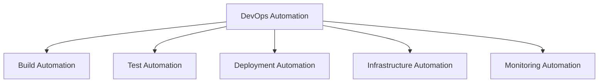
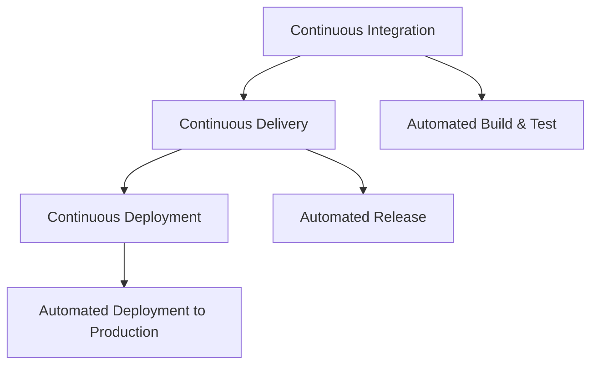

# Lecture 1: Introduction to Automation and the Software Delivery Pipeline

## 1. Introduction to Automation in DevOps (10 minutes) 🤖

### 1.1 What is Automation?

Automation in DevOps refers to the use of technology to perform tasks with reduced human assistance. It aims to streamline and accelerate the software development and delivery process.

### 1.2 Importance of Automation in DevOps

- Increases efficiency and productivity
- Reduces human errors
- Enables faster delivery of software
- Facilitates consistency across environments
- Allows for more frequent releases

### 1.3 Areas of Automation in DevOps

## 2. The Software Delivery Pipeline (20 minutes) 🔄

### 2.1 What is a Software Delivery Pipeline?

A Software Delivery Pipeline is a set of automated processes and tools that allow developers and operations professionals to reliably and efficiently compile, build and deploy their code to their production compute platforms.

### 2.2 Stages of a Typical Software Delivery Pipeline

1. **Code**: Developers write and commit code to version control
2. **Build**: Code is compiled and built into deployable artifacts
3. **Test**: Automated tests are run to ensure quality
4. **Release**: Approved code is prepared for deployment
5. **Deploy**: Code is deployed to production environments
6. **Operate**: Application is monitored and maintained in production

### 2.3 Key Components of a Software Delivery Pipeline

1. **Version Control System**: (e.g., Git) Manages code changes and collaboration
2. **Build Server**: (e.g., Jenkins) Automates the compilation and packaging of code
3. **Artifact Repository**: (e.g., Nexus) Stores built artifacts
4. **Test Automation Tools**: (e.g., Selenium) Run automated tests
5. **Deployment Tools**: (e.g., Ansible) Automate the deployment process
6. **Monitoring Tools**: (e.g., Prometheus) Monitor application performance and health

## 3. Overview of the Continuous Delivery Pipeline (20 minutes) 🚀

### 3.1 What is Continuous Delivery?

Continuous Delivery (CD) is a software engineering approach in which teams produce software in short cycles, ensuring that the software can be reliably released at any time.

### 3.2 Continuous Delivery vs. Continuous Deployment

- **Continuous Delivery**: Ensures software is always in a releasable state
- **Continuous Deployment**: Automatically deploys all changes to production

### 3.3 Key Principles of Continuous Delivery

1. Build quality in
2. Work in small batches
3. Automate repetitive tasks
4. Pursue continuous improvement
5. Everyone is responsible for the delivery process

### 3.4 Benefits of Continuous Delivery

- Faster time to market
- Higher quality and more reliable releases
- Improved productivity and efficiency
- Greater ability to build the right product

## 4. Fully Automated Software Delivery Process (15 minutes) ⚙️

### 4.1 Characteristics of a Fully Automated Delivery Process

1. **Automated Builds**: Code changes trigger automatic builds
2. **Automated Testing**: Comprehensive test suites run automatically
3. **Automated Deployments**: Successful builds are automatically deployed
4. **Infrastructure as Code**: Environment provisioning is automated
5. **Automated Rollbacks**: Quick recovery from failed deployments
6. **Continuous Monitoring**: Automated performance and health checks

### 4.2 Tools for Fully Automated Delivery

1. **CI/CD Tools**: Jenkins, GitLab CI, CircleCI
2. **Configuration Management**: Ansible, Puppet, Chef
3. **Containerization**: Docker, Kubernetes
4. **Infrastructure as Code**: Terraform, CloudFormation
5. **Monitoring and Logging**: ELK Stack, Prometheus, Grafana

### 4.3 Challenges in Implementing Full Automation

- Initial setup complexity
- Maintaining test quality and coverage
- Ensuring security in automated processes
- Managing configuration drift
- Handling database changes and migrations

## Conclusion and Looking Ahead (5 minutes)

In this lecture, we've introduced the concept of automation in DevOps and explored the Software Delivery Pipeline. We've also looked at the principles of Continuous Delivery and the characteristics of a fully automated software delivery process.

In our next lecture, we'll dive deeper into the specific automated processes within the Continuous Delivery Pipeline, including automated builds, tests, and deployments.

## Additional Resources

- Book: "Continuous Delivery: Reliable Software Releases through Build, Test, and Deployment Automation" by Jez Humble and David Farley
- Article: "What is a CI/CD pipeline?" on RedHat's website
- Video: "Continuous Integration vs Delivery vs Deployment" by DevOps Directive on YouTube
- Online Course: "DevOps Automation" on Coursera

