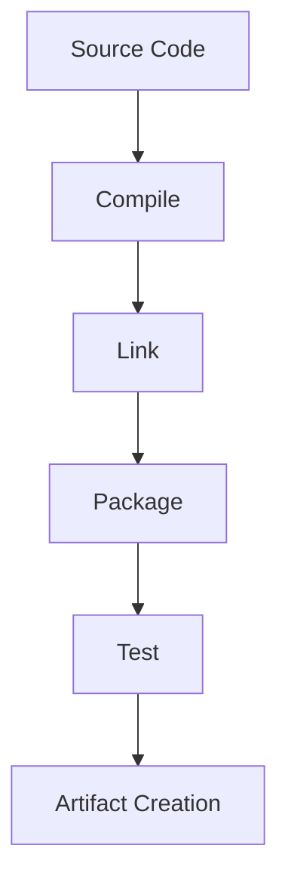
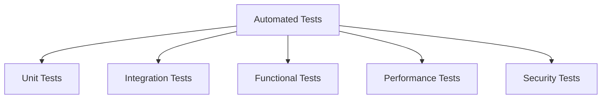

# Lecture 2: Continuous Delivery Pipeline and Automated Processes

## 1. The Build Process (15 minutes) 🏗️

### 1.1 What is the Build Process?

The build process is the compilation of source code into executable code, along with any necessary packaging and preparation for deployment.

### 1.2 Steps in a Typical Build Process

1. **Compile**: Convert source code into object code
2. **Link**: Combine object code with libraries
3. **Package**: Bundle all necessary components
4. **Test**: Run unit tests
5. **Artifact Creation**: Generate deployable artifacts

### 1.3 Build Tools

- **Java**: Maven, Gradle, Ant
- **JavaScript**: npm, Webpack
- **C#/.NET**: MSBuild
- **Python**: setuptools, pip

## 2. Automated Build (15 minutes) 🤖

### 2.1 What is an Automated Build?

An automated build is the process of automating the creation of a software build including compiling, packaging, and running automated tests.

### 2.2 Benefits of Automated Builds

1. Consistency and reproducibility
2. Early detection of integration issues
3. Faster feedback to developers
4. Improved code quality
5. Increased productivity

### 2.3 Implementing Automated Builds

1. Use version control systems (e.g., Git)
2. Set up a CI server (e.g., Jenkins, GitLab CI)
3. Define build scripts
4. Configure build triggers
5. Set up notifications for build status

## 3. Automated Testing (20 minutes) 🧪

### 3.1 Types of Automated Tests

### 3.2 Benefits of Automated Testing

1. Faster feedback
2. Increased test coverage
3. Improved reliability
4. Enables continuous integration and delivery
5. Saves time and resources in the long run

### 3.3 Implementing Automated Testing

1. Choose appropriate testing frameworks
2. Write testable code
3. Create a test strategy
4. Integrate tests into the CI/CD pipeline
5. Monitor and maintain test suites

### 3.4 Best Practices for Automated Testing

1. Follow the test pyramid (more unit tests, fewer UI tests)
2. Keep tests independent
3. Use test data management
4. Implement test result reporting
5. Continuously refactor and improve tests

## 4. Automated Deployment (20 minutes) 🚀

### 4.1 What is Automated Deployment?

Automated deployment is the process of deploying applications to various environments (e.g., staging, production) without manual intervention.

### 4.2 Steps in Automated Deployment

### 4.3 Benefits of Automated Deployment

1. Faster and more frequent releases
2. Reduced human error
3. Consistent and repeatable process
4. Easier rollbacks
5. Improved collaboration between development and operations

### 4.4 Implementing Automated Deployment

1. Use Infrastructure as Code (IaC)
2. Implement environment-specific configurations
3. Use deployment strategies (e.g., blue-green, canary)
4. Set up monitoring and alerting
5. Implement automated rollback mechanisms

### 4.5 Tools for Automated Deployment

- Ansible
- Kubernetes
- Terraform
- AWS CodeDeploy
- Octopus Deploy

## 5. Automated Deployment and DevOps Adoption (15 minutes) 🔄

### 5.1 How Automated Deployment Facilitates DevOps

1. Bridges the gap between development and operations
2. Enables faster feedback loops
3. Supports continuous improvement
4. Enhances collaboration and communication
5. Aligns with DevOps principles (e.g., automation, measurement)

### 5.2 Challenges in Adopting Automated Deployment

1. Cultural resistance
2. Legacy systems
3. Security concerns
4. Skill gap
5. Initial setup complexity

### 5.3 Strategies for Successful Adoption

1. Start small and iterate
2. Invest in training and upskilling
3. Choose the right tools for your needs
4. Foster a culture of collaboration
5. Continuously measure and improve

## Conclusion and Looking Ahead (5 minutes)

In this lecture, we've explored the key components of a Continuous Delivery pipeline, including automated builds, tests, and deployments. We've seen how these automated processes contribute to faster, more reliable software delivery and support DevOps practices.

In our next lecture, we'll dive into Rapid Application Development (RAD) and code generation, exploring how these concepts further enhance the efficiency of software development and delivery.

## Additional Resources

- Book: "Continuous Delivery" by Jez Humble and David Farley
- Article: "What is Automated Deployment?" on Atlassian's website
- Video: "Automated Testing Best Practices" by Google Testing Blog on YouTube
- Online Course: "Automated Software Testing" on edX

