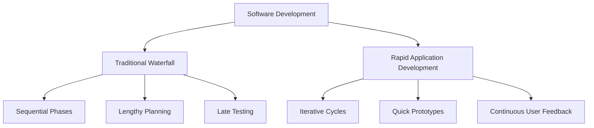
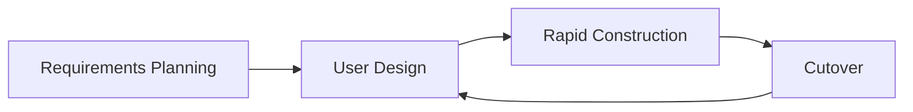
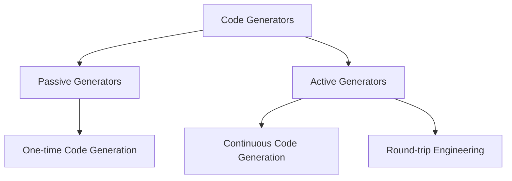

# Lecture 3: Rapid Application Development (RAD) and Code Generation

## 1. Overview of Rapid Application Development (RAD) (15 minutes) 🚀

### 1.1 What is Rapid Application Development?

Rapid Application Development (RAD) is an agile software development methodology that prioritizes rapid prototyping and quick feedback over long, pre-planned development and testing cycles.

### 1.2 Key Principles of RAD

1. Prototyping
2. Iterative development
3. Time-boxing
4. Team collaboration
5. Less emphasis on planning and more on adaptability

### 1.3 RAD vs Traditional Development Models

## 2. Phases in RAD (20 minutes) 🔄

### 2.1 The Four Phases of RAD

1. **Requirements Planning**: Determine objectives and requirements
2. **User Design**: Work with users to design the system
3. **Rapid Construction**: Build the system through iterative development and testing
4. **Cutover**: Transition from the old system to the new system

### 2.2 Detailed Look at Each Phase

#### Requirements Planning
- Scope definition
- Constraints identification
- System requirements

#### User Design
- Prototyping
- Continuous user feedback
- Refinement of requirements

#### Rapid Construction
- Iterative development
- Component reuse
- Automated code generation

#### Cutover
- User acceptance testing
- Data conversion
- Implementation of the new system

## 3. Essential Aspects of RAD (15 minutes) 💡

### 3.1 Key Components of RAD

1. **Joint Application Development (JAD) Sessions**: Collaborative workshops
2. **Time-boxing**: Fixed time frames for development cycles
3. **CASE Tools**: Computer-Aided Software Engineering tools for automation
4. **Code Reusability**: Leveraging existing components and libraries
5. **Prototyping**: Rapid creation of working models

### 3.2 Advantages of RAD

1. Faster development and delivery
2. Increased user involvement and satisfaction
3. Flexibility to accommodate changes
4. Reduced development costs
5. Early visibility of the system

### 3.3 Limitations of RAD

1. Requires skilled developers and designers
2. May not be suitable for large-scale projects
3. Risk of scope creep due to constant changes
4. Depends on strong user involvement throughout the process

## 4. Code Generation (20 minutes) ⚙️

### 4.1 What is Code Generation?

Code generation is the process of producing source code based on an abstract description of the desired code's functionality.

### 4.2 Benefits of Code Generation

1. Increased productivity
2. Consistency in coding style and structure
3. Reduced manual coding errors
4. Easier maintenance and updates
5. Facilitates the implementation of design patterns

### 4.3 Types of Code Generation

1. **Static Code Generation**: Code is generated once and then manually maintained
2. **Dynamic Code Generation**: Code is generated at runtime

### 4.4 Code Generation Techniques

1. Templates
2. Model-Driven Development (MDD)
3. Domain-Specific Languages (DSLs)
4. Metaprogramming

## 5. Categories of Code Generators (15 minutes) 🗂️

### 5.1 Types of Code Generators

1. **Passive Generators**: Generate code once, which is then manually maintained
2. **Active Generators**: Continuously synchronize the model and the code

### 5.2 Examples of Code Generators

1. **ORM Tools**: Hibernate, Entity Framework
2. **API Generators**: Swagger Codegen, OpenAPI Generator
3. **UI Generators**: Angular Schematics, React Boilerplate
4. **Mobile App Generators**: Flutter's code generation, React Native's scaffolding tools
5. **Database Schema Generators**: Liquibase, Flyway

### 5.3 Implementing Code Generation in RAD

1. Choose appropriate code generation tools
2. Define templates or models
3. Integrate code generation into the development workflow
4. Balance generated code with manual customization
5. Maintain and update generation templates as needed

## Conclusion and Looking Ahead (5 minutes)

In this lecture, we've explored Rapid Application Development (RAD) methodology and the concept of code generation. We've seen how RAD emphasizes quick prototyping and iterative development, and how code generation can significantly speed up the development process.

In our next lecture, we'll begin discussing the advantages of automation in various scenarios, starting with common automation tasks in system administration and DevOps practices.

## Additional Resources

- Book: "Rapid Development: Taming Wild Software Schedules" by Steve McConnell
- Article: "Code Generation: Technique for Rapid Software Development" on DZone
- Video: "Introduction to Rapid Application Development (RAD)" on YouTube
- Online Course: "Rapid Application Development" on Udemy

